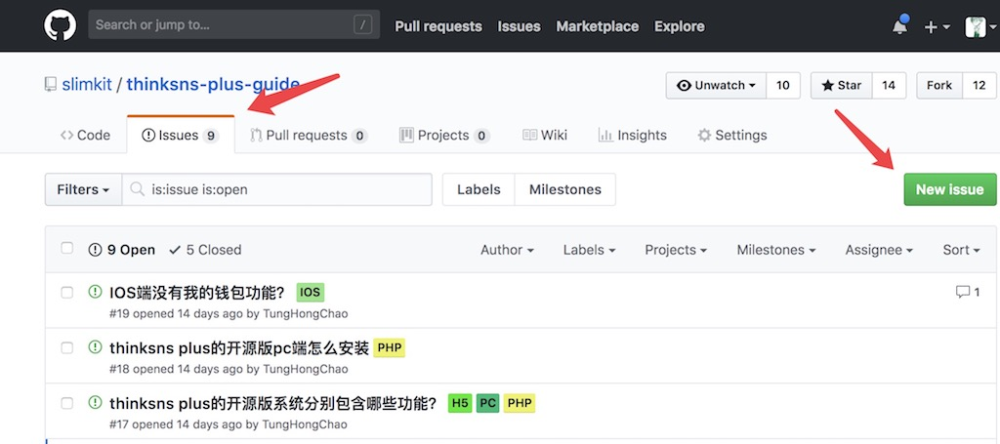

# ThinkSNS Plus Help

&nbsp;&nbsp;&nbsp;&nbsp;&nbsp;&nbsp;&nbsp;`ThinkSNS+`打造社交运营为核心的应用级软件系统源码及定制开发服务。支持动态拓展应用的接入和UI规范设计。更多关于`ThinkSNS+`请访问[ThinkSNS+](http://www.thinksns.com/index.html)。 
&nbsp;&nbsp;&nbsp;&nbsp;&nbsp;&nbsp;&nbsp;该文档记录`ThinkSNS+`产品常见问题。我们记录授权产品在实际使用过程中常见的问题，推荐你查阅。它们是点击量非常高的问题，当然也包括部分以前没见过的问题。 

# 各端常见问题

* [服务端](https://github.com/slimkit/thinksns-plus-guide/issues?q=is%3Aopen+is%3Aissue+label%3APHP)
* [iOS端](https://github.com/slimkit/thinksns-plus-guide/issues?q=is%3Aopen+is%3Aissue+label%3AIOS)
* [Android端](https://github.com/slimkit/thinksns-plus-guide/issues?q=is%3Aopen+is%3Aissue+label%3AAndroid)
* [PC端](https://github.com/slimkit/thinksns-plus-guide/issues?q=is%3Aopen+is%3Aissue+label%3APC)
* [H5](https://github.com/slimkit/thinksns-plus-guide/issues?q=is%3Aopen+is%3Aissue+label%3AH5)

# 问题反馈

在授权`ThinkSNS+`使用过程中，有任何未记录的问题可以通过`issues`添加。

# 商务合作
  客服：QQ 3515923610  
  咨询热线： 17311245680  
  微信： 
  
 &nbsp; 

微信公众号： 

> **备注**
> 
- [Github仓库搜索官方指南](https://help.github.com/articles/searching-repositories/) 
- [Github搜索语法](https://help.github.com/articles/search-syntax/) 
- [Github高级搜索](https://help.github.com/articles/advanced-search/) 
