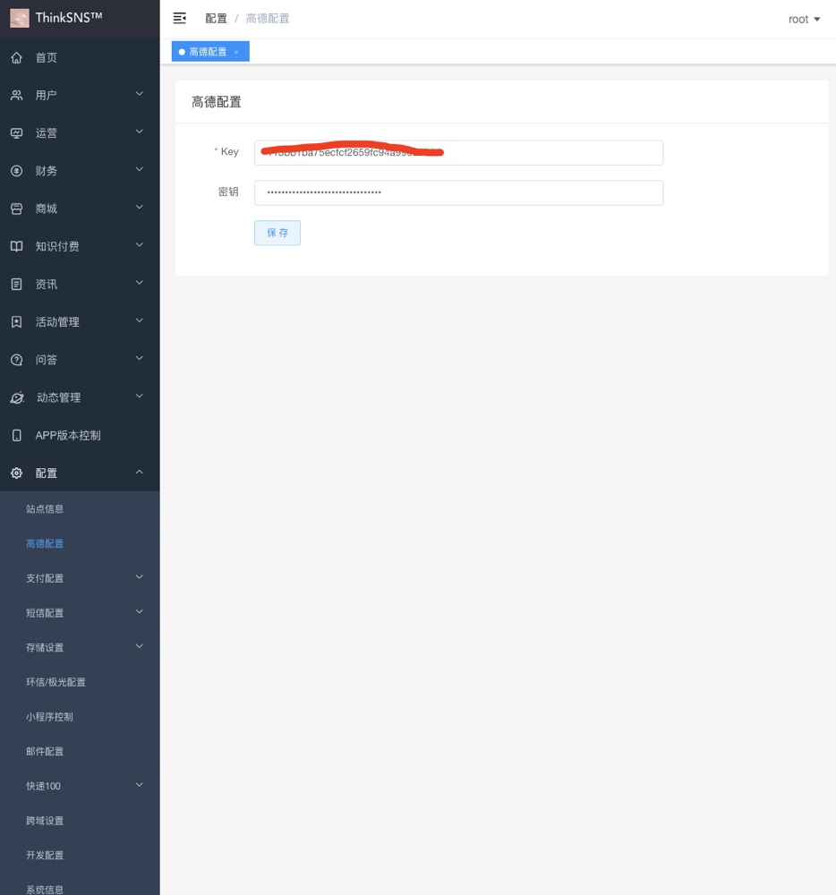
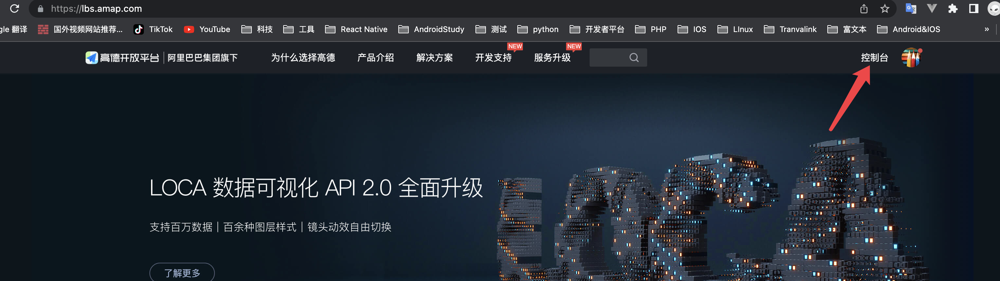

# 高德IP定位配置说明

#### 一、配置入口

管理后台 - 配置 - 高德配置

#### 二、 key 秘钥获取

1. [登录高德管理后台](https://lbs.amap.com/)

2. 登录账号并进入控制台 

   

3. 创建应用
   

4. 根据需求看是否需要 安卓和ios 的配置，如果需要自行添加即可，对应配置信息可咨询开发人员

5. web服务（必要内容），创建后更具自身需求是否需要添加白名单。通过设置中开启数字签名来获取私钥，添加管理后台配置的密钥出

   