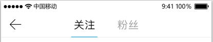

2017年5月11日 11:41:47
# TabSelectView自定义控件
ToolBar上切换viewPager的选项卡控件



## 概述
   在ToolBar中集成第三方库[MagicIndicator指示器](https://github.com/hackware1993/MagicIndicator)，
   使用viewpager页面切换的标题栏。

## 使用
   在布局文件中添加该控件。<br>
   在代码中进行初始化,调用如下方法：
   ```
   public void initTabView(ViewPager viewPager, List<String> stringList) {
     ...
   }
   ```
   **注意：当前只支持传入固定的页数，也就是说在调用initTabView方法后，不能动态修改**

