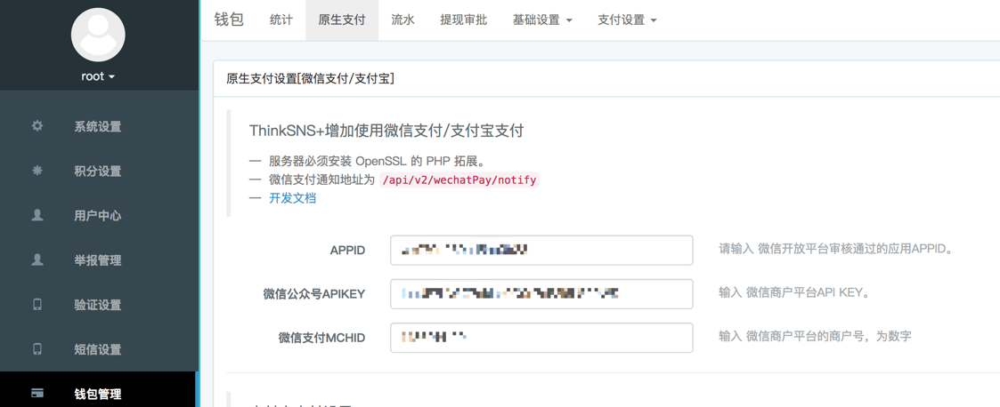
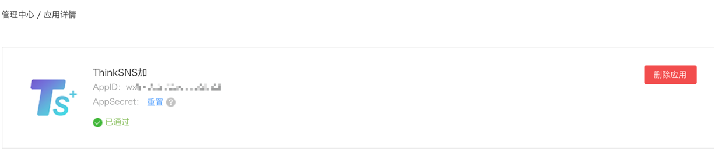
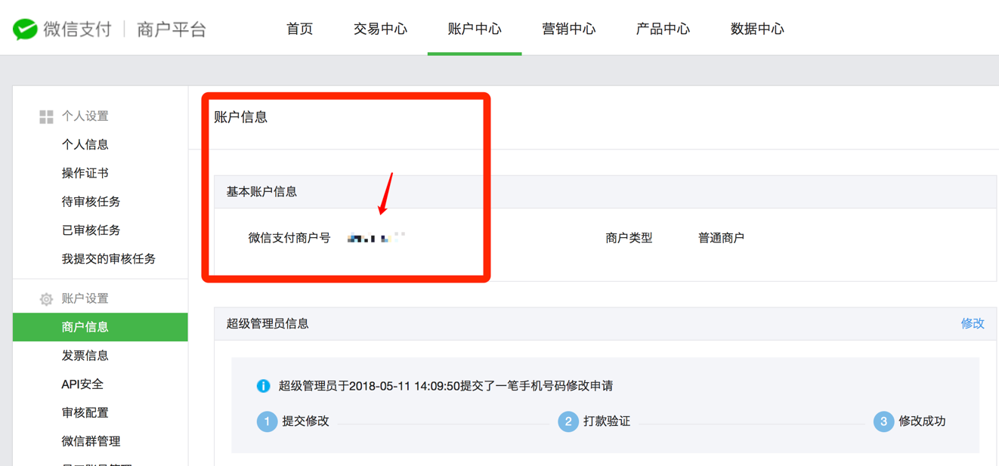
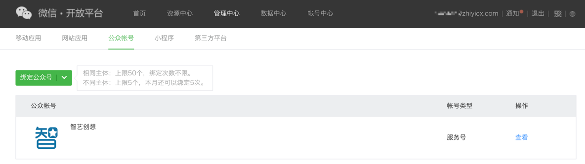
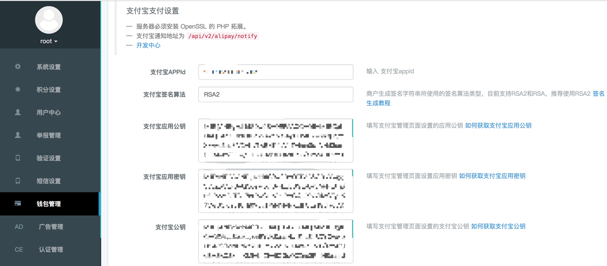
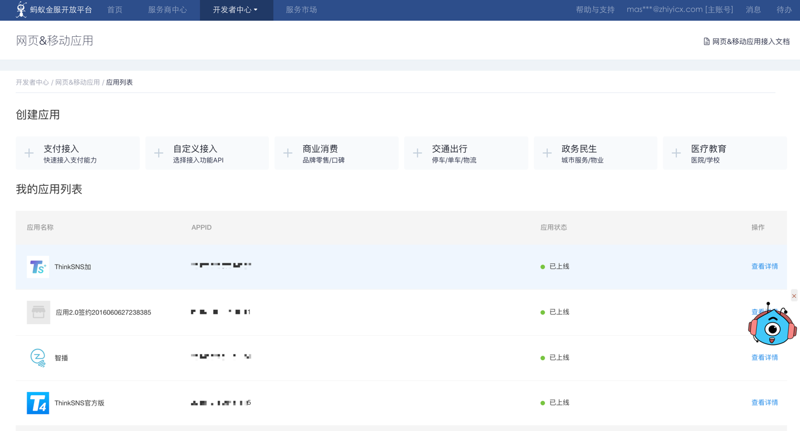
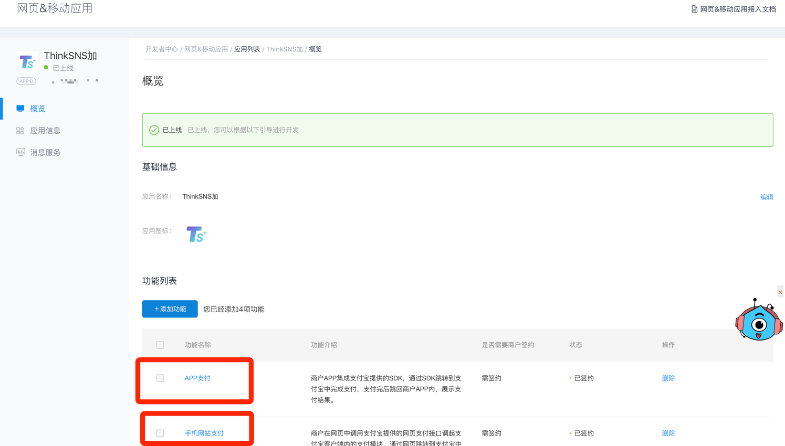
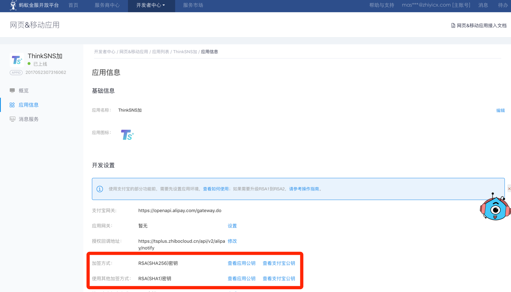
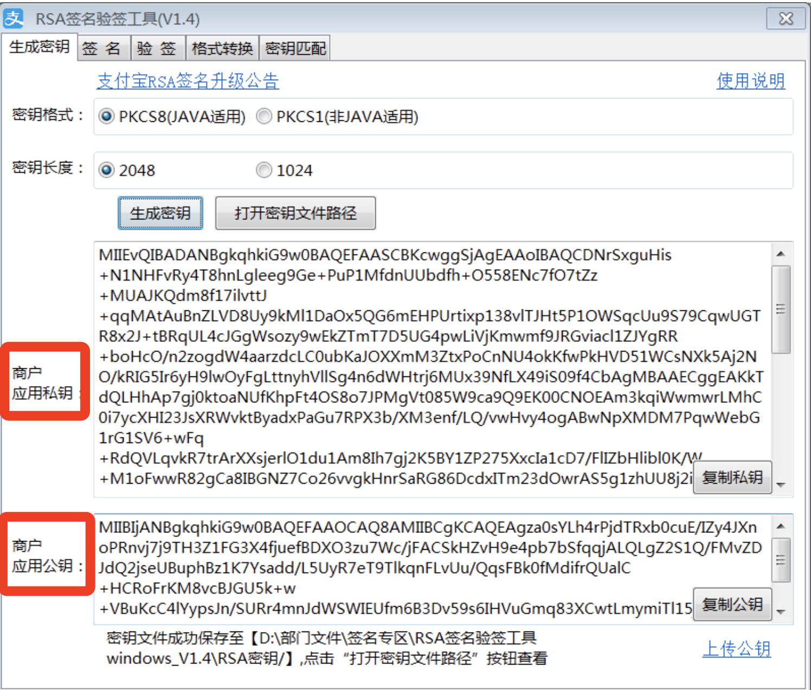
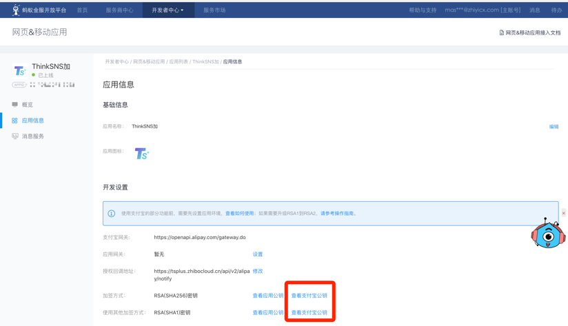

# 
ThinkSNS Plus原生支付配置说明

## 概述

包括两个部分：

1. 微信APP支付；
2. 支付宝[商户]支付;

推荐阅读此文档的目标群体

- 有开发能力/调试能力的人员
- 能够阅读微信/支付宝开发文档的人员

## 目录

- [微信支付信息配置](#微信支付信息配置)
- [支付宝支付信息配置](#支付宝支付信息配置)

----

### 微信支付信息配置

#### 微信相关开发文档
 
1. [微信APP支付接入商户服务中心](https://open.weixin.qq.com/cgi-bin/showdocument?action=dir_list&t=resource/res_list&verify=1&id=open1419317780&token=&lang=zh_CN)
2. [微信APP支付](https://pay.weixin.qq.com/wiki/doc/api/app/app.php?chapter=8_1)

#### TS+后台微信配置说明

如图所示： 有3个选项需要填入

1. APPID：此APPID为[微信开放平台](https://open.weixin.qq.com)中申请的移动应用的, gif展示

	

	和appid相关的内容，一下两点必须满足	
	
	- 此应用已经在微信开放平台通过认证

		
	- 此应用已经在开放平台获得了支付能力，入下图所示
		
		
2. 	微信公众号APIKEY，可能这个描述有点不准确，准确该是：在微信商户管理平台的账户中心设置的API密钥
		
	
	
	> 这个是用户你自己设置的密钥，微信不会自动帮你生成，**设置好之后必须妥善保管！**
	
3. mchid: 这个就很直白了，只要你的商户平台通过审核，就会分配给你一个账号就是打了马赛克的这一部分：	
	
	
4. 虽然后台需要填写的资料只有上面的3个，但是还有一个很重要的步骤，就是【服务号】与【开放平台】的绑定操作，必须要绑定，此绑定除了支付之外，微信内分享和微信登录都会需要，这个操作在微信开放平台操作
		
	
	
	
5. **特别提示： 【服务号】必须开通【商户服务】，也就是微信支付的基础，【微信开放平台】中申请的应用必须通过审核，而且必须获得微信支付能力，微信支付能力只有移动应用才拥有， 微信配置完结**

-----

### 支付宝支付信息配置
		
		注： 支付宝支付只支持商家服务
		
#### 支付宝相关文档

1. [签名专](https://docs.open.alipay.com/291/106103/)
2. [app支付](https://docs.open.alipay.com/204)
3. [手机网站支付](https://docs.open.alipay.com/203)
4. [电脑网站支付](https://docs.open.alipay.com/270)
5. [应用接入](https://docs.open.alipay.com/399/)
6. [支付宝开发平台开发文档总汇](https://docs.open.alipay.com/catalog)

#### TS+后台支付宝配置说明

	
**支付宝的配置项一共有5个，我们按照从上到下的顺序来说明，但是先说一个前提，请先在支付宝`商家中心-> 产品中心-> 我的产品中查看【高级手机网站支付2.0，高级手机APP支付2.0】`这两项是不是签约了，如果没有的话，请先完成这两项的签约前置事宜，否则，此文档无效**

1. 支付宝APPID： 此项是在支付宝开放平台获得

	
	
	成为开放平台开发者后，可以创建网页/移动应用，创建成功后，会为你的应用分配一个appid，我们需要的就是这个appid，上图打了马赛克的部分，切记，应用需要过审，而且需要添加应用的支付能力，因为此应用是app和网页公用，所以请添加app支付和手机网站支付，以及电脑网页支付【截图区域问题未截到】这3项支付能力
	
	
		
2. 支付宝签名算法： 这个其实就是给支付宝支付预先设置一个加秘钥，请看教程 [生成RSA密钥](https://docs.open.alipay.com/291/105971/)，选项仅有2项： RSA和RSA2
3. 支付宝应用公钥： 支付宝应用是我们在 1. 中创建的应用，然后在应用详情中
		
	
	需要根据自身需要为应用设置加签方式推荐使用RSA2的方式，按照上诉2中生成RSA密钥的教程生成出应用的公钥和密钥
	
	密钥长度 2048对应RSA2， 1024对应RSA，根据你生成的公钥和私钥，在应用信息页面设置应用公钥，也就是查看应用公钥，会有一个弹窗，点击修改，填入公钥，千万注意，这里填入的是公钥，**在支付宝开放平台填写之后，也要将这个填入TS+后台的支付宝应用公钥此项中**
	
4. 支付宝应用密钥:  填入的内容就是上一步骤中，在工具中生成的支付宝应用密钥，
5. 上述步骤在支付宝开放平台填写了商家应用公钥之后，支付宝会生成一个支付宝公钥，[根据RSA或者RSA2会生成不同类型的支付宝公钥]
	
	
	点击查看支付宝公钥[需要手机验证], 获取到后，填入到TS+管理后台的 支付宝公钥中，支付宝配置到此结束
	
6. **提示： 支付宝开放平台应用创建成功后，必须过审，必须添加APP支付，手机网站支付，电脑网站支付这3项支付能力，必须给应用设置相应的加签方式【推荐RSA2】，并设置应用公钥**
		
		
		
		
		
		
		
		
		
		
		
		