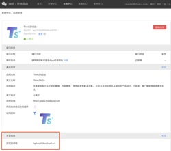
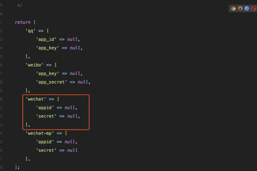
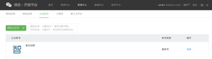
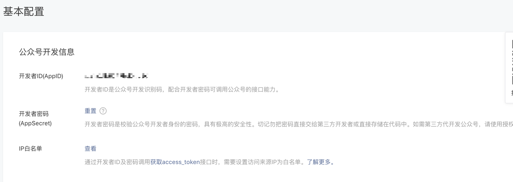
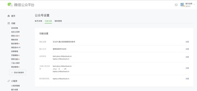
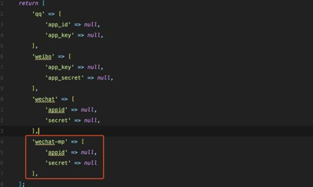
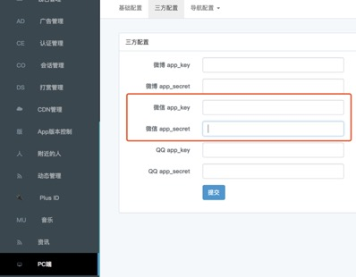

# 
ThinkSNS Plus微信登录配置

## 概述

包括两个部分：

1. H5在微信浏览器内登录；
2. 在APP和PC中登录;

推荐阅读此文档的目标群体

- 有开发能力/调试能力的人员
- 能够阅读微信开发文档的人员

### 微信登录的前置信息

#### 一、后台和PC配置

1. 在微信开放平台中申请移动应用和网页应用，此两项为不同的的应用，分别在APP微信登录以及PC上做微信登录使用，**移动、网页应用申请后需要过审[非常重要]**，网页应用申请后，需要填写回调地址

	

	> 此回调地址具体参见开放平台的最新规定，微信登陆后，会跳转到该地址

2. 应用申请好之后，会获得`appid`和`Appsecret`，移动端在获取登录凭证并做登录操作是需要的配置会稍微复杂一点，微信登录的操作由扩展包由`plus-socialite`完成，同时支持QQ登录和微博登录，需要在TS+程序根目录`/packages/slimkit-plus-socialite/config/socialite.php`中配置在开放平台中获取到的`Appid`和`Appsecret`
，如果是在配置已经发不过之后，`socialite.php`的位置会出现在程序根目录`/config/socialite.php`中，直接配置此文件即可；

	

3. 微信公众号必须准备，由于微信登录是基于微信公众号中获取`openid/unionid`来进行登录，所以必须要准备一个认证**通过**的公众号[推荐服务号]，并且需要在开放平台中**绑定此公众号**

	
		
	并且在微信公众号中设置一些必要的选项：
	
	1. 白名单：微信公众号 -> 开发 -> 基本配置 -> 白名单/AppSecret
	
		
	
		此两项为必须设置，否则无法获取到`openid/unionid`
		
	2. 域名设置：微信公众号->设置->公众号设置->功能设置, 每一项域名都有明确的说明填写之后会有什么样的效果，请仔细阅读
	
		
	

		**此项也是必填，否则无法唤起登录接口**
		
	3. H5需要的配置：在`/packages/slimkit-plus-socialite/config/socialite.php`中，有`wechat-mp`配置项，填入上面白名单配置处设置的`Appsecret`和开发者`id(appid)`。
		

	4. 设置了微信开放平台和公众平台绑定之后，微信登录获取到的是统一的`unionid`，如果pc和app登录出现异常，可以咨询微信客服，是否需要合并移动应用和网页应用

	5. PC微信登录还需要在TS+后台做一些配置，
	
		

		> 这里需要填入微信开放平台申请的网页应用的`appid`和`Appsecret`，必须填写
		
		
### 二、移动端微信登录配置

#### Android 

Android 请查看[三方账号配置](https://github.com/slimkit/thinksns-plus-guide/blob/master/%E6%8A%80%E6%9C%AF%E6%96%87%E6%A1%A3/Android-Platform/document/tutorial/SecondaryDevelopmentResourceReplaceTutorial.md#%E7%AC%AC%E4%B8%89%E6%96%B9%E8%B4%A6%E5%8F%B7%E9%85%8D%E7%BD%AE)
	
#### IOS 
IOS 请查看[第三方账号配置](https://github.com/slimkit/thinksns-plus-guide/blob/master/%E6%8A%80%E6%9C%AF%E6%96%87%E6%A1%A3/iOS%E7%AB%AF/TS+%20iOS%E7%AB%AF%E5%BA%94%E7%94%A8%E9%85%8D%E7%BD%AE.md#%E7%AC%AC%E4%B8%89%E6%96%B9%E8%B4%A6%E5%8F%B7%E9%85%8D%E7%BD%AE)
#### H5 
	h5代码不用配置

		
**注意**：微信开放平台中的应用，都必须过审，并且获得微信登录的能力，请严格按照上述步骤进行配置，缺一不可，配置说明完结

