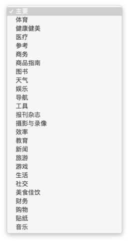

# App Store上架需要准备资料

## 一. 需要提供的文案
1. 名称
说明：您的 App 在 App Store 中显示的名称。名称长度不能超过 50 个字符。
备注：客户前期已经提供
提供：
2. 隐私政策网址(URL)  【选填 建议填写】
说明：链接至您所在机构隐私政策的网址(URL)。所有面向儿童的 App，或者提供自动续订或免费订阅的 App，都必须提供隐私政策。此外，如果 App 包含帐户注册或需要访问用户的现有帐户，或由法律另行规定，也必须提供隐私政策。对于收集用户或设备相关数据的 App，也建议提供隐私政策。
备注：基于TS的app可以：域名/ts4/api.php?mod=Public&act=showAgreement
例如：TS官方接口域名为：http://demo.thinksns.com，即填写：
http://demo.thinksns.com/ts4/api.php?mod=Public&act=showAgreemen
t
提供：
3. 套装 ID
说明：套装 ID 必须与您在 Xcode 中使用的 ID 相符。该 ID 在您上传第一个构建版本后便无法更改。
备注：同bundle ID，客户前期已经提供
提供：
4. SKU
说明：App 专有的 ID, 此 ID 不会在 App Store 中显示。
备注：任意数字即可
5. 主要语言
说明：如果 App 信息没有针对某个国家的 App Store 进行本地化, App 信息将以主要语言呈现。
备注：针对国内用户的客户建议选择简体中文
提供：
6. 类别
说明：
备注：有一个主要分类和次要分类，都是单选其一。提供选项如下

提供：主要分类： 次要分类：

7. 分级
说明：此 App 分级将在所有平台的 App Store 中显示。此分级根据分级限制最高的 App 平台而定。
备注：
下方列有10个问题选项。其中每一个问题都必须选择
1]“没有（None）”，2]“偶尔或轻微（Infrequent/Mild）”. 3]“频繁或强烈（Frequent/Intense）”。

A.Cartoon or Fantasy Violence卡通或幻想暴力
B.Realistic Violence 现实暴力
C.Sexual Content or Nudity 色情或裸色内容
D.Profanity or Crude Humor 亵渎或低俗幽默
E.Alcohol, Tobacco, or Drug Use or References 酒精. 烟草或毒品使用或参考信息
F.Mature/Suggestive Themes 成人/性暗示主题
G.Simulated Gambling 模拟赌博
H.Horror/Fear Themes 惊悚/恐怖主题
I.Prolonged graphic or sadistic realistic violence持久直白或虐待狂现实暴力
J.Graphic sexual content and nudity 直白的色情和裸色内容

提供：按A~J 对应评分

8. 描述
说明：对您 App 的描述，用以详细说明特性和功能。它还将用于您的 Apple Watch App。
备注：对app的描述，建议200字以内
提供：

9. 关键字
说明：一个或多个关键词，用以描述您的 App。关键词将使 App Store 搜索结果更加准确。关键词之间用英文逗点分隔。
备注：准确的关键字有利于app检索
提供：

10. 技术支持网址(URL) 
说明：您的 App 技术支持信息网址(URL)。该网址(URL)将会在 App Store 中显示。
备注：建议填写官网首页URL
提供：

11. 营销网址(URL)
说明：您的 App 营销信息网址(URL)。该网址(URL)会在 App Store 中显示。
备注：建议填写官网首页URL
提供：

12. 版权
说明：拥有您的 App 专有权的人员或实体的名称，前面是获得权利的年份（例如“2008 Acme Inc”）。请勿提供网址(URL)。
备注：
提供：

13. 版本号
说明：您要填入的 App 版本号。编号应遵循软件版本规范。
备注：一般从1.0开始叠加
提供：

14. 开发者信息
说明：开发者信息
备注：姓名. 联系电话. 邮编. 邮箱. 省. 市. 区. 街道名
提供：

15. 审核信息
15.1 联系人
备注：姓名. 电话. 邮箱
提供：

15.2 备注
说明：对审核过程会有所帮助的. 有关您 App 的额外信息, 包括在测试中需要的 App 特别设置等
备注：可以填写多个测试账号和其他
提供：

15.3 演示帐户
说明：提供可在审核过程中查看 App 所有功能的演示帐户的用户名和密码。从社交媒体 App 使用单一登录机制的 App 也包含在此要求中。演示帐户不应包含有效期限或个人信息。如果您希望加入其他帐户信息，请在“备注”字段内添加。
备注：一定要确保账号密码的正确性
提供：

二. 需要提供的素材
1. app logo
要求：1024*1024分辨率，直角，不透明的PNG图片（去除透明度）
备注：如果logo由我司设计则该素材由我司提供
提供：以附件形式提供

三. 注意事项：
1. app在提交审核之前需要添加每一个大板块中的内容，内容要求。
A. 内容要与app运营内容相符合，并且符合国家相关政策指导。
B. 不能出现购买或者付费服务或者VIP宣传。
C. 不能宣传app在除苹果平台使用，如宣传安卓版本的app。可以出现“来自H5”或者“来自安卓”的动态。
D. 确保每一个板块都有内容，让app看起来就是已经在运营而不是测试版本。不要出现“测试”. “内测”等关键字。
E. 以上内容可以在App Store上架成功后清理
2. app提交审核前，添加至少5～10名用户参与社区互动，丰富内容。
3. 提供的测试账号的用户信息要确保正式且内容为积极的内容
