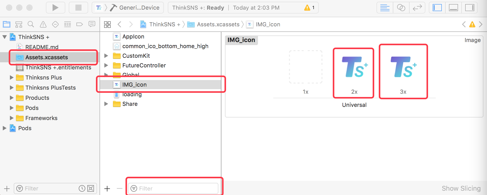
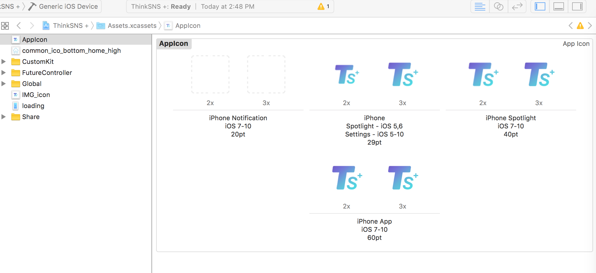

# TS+ iOS端应用配置

* 目录
	* [简单界面调整](#简单界面调整)
	* [图片素材替换](#图片素材替换)
	* [分享内容配置]#(暂无)

	
* 目录
 * [简单界面调整](#简单界面调整)
 * [图片素材替换](#图片素材替换)
 * [分享内容配置]#(暂无)


## 简单界面调整

本应用的UI设计是按照的`ThinkSNS Plus Plus 视觉规范`.颜色记录在`~/CustomUIKit/TSUserInterfacePrinciples/TSColor.swift`,字号记录在`~/CustomUIKit/TSUserInterfacePrinciples/TSFont.swift`,部分通用控件如弹窗记录在`~/CustomUIKit/`文件夹内.

### 应用名调整

修改 `~/SupportFile/InfoPlist.strings` 文件内的 CFBundleDisplayName 值.**注意**此处有两个文件, 分别对应英文设备和中文设备下应用的名称.

## 图片素材替换

本工程所有图片素材记录在`~/Assets.xcassets/`内.将新的图片生成旧图片一样的规格一致的文件名称后,将新图片覆盖对应文件夹内的图片即可.

### 1、 图片素材替换概述

#### A. 基本概述
* 文档只涉及一些基本的图标和图片替换，不涉及更深层次的替换。如果需要更深层次的替换，请参考具体源码。
* 基本替换图标
	* AppIcon(应用图标)
	* Tabbar(标签栏图标)
	* Share Logo(分享Logo)
* 基本图片替换
	* 启动页
	* 缺省图

#### B. 本地图片相关
* 2.1：iOS本地图标和图片都使用png格式的
* 2.2：iOS本地图标和图片都需要2倍图和3倍图。
* 2.3：命名问题，以命名为AppIcon_20pt的正方形图标为例
	* AppIcon_20pt@2x.png (2倍图尺寸：40x40)
	* AppIcon_20pt@3x.png (3倍图尺寸：60x60)

#### C. 约定规范
* 下面所指定的图标或图片名都是指Assets.xcassets中左侧列表栏中对应的名字，图标或图片的实际名字不是必须和指定的名字统一，但建议使用指定的名字。

#### D. 替换示例



* 将上图中的2x和3x图片使用delete键删除掉，然后往2x和3x位置放上对应倍数的替换图片即可。如果1x位置原来有图片，必须删除，即使没有准备对应的1x图片。
* 替换时，注替换图片命名规范。前面部分参考指定命名，后面的@2x.png 和 @3x.png 一定要加上。

### 2、基本图标替换

### A. AppIcon(应用图标)
* Assets中命名：```AppIcon```
* 尺寸：
	* 20pt的2倍图和3倍图(40x40, 60x60)、
	* 29pt的(58x58, 87×87)、
	* 40pt的(80x80, 120x120)、
	* 60pt的(120x120, 180x180)
* 图标名：名称随便，(但保证2倍图和3倍图的后缀)
* TS+图标命名：

```
icon_1024iPhoneApp_60pt@2x.png
icon_1024iPhoneApp_60pt@3x.png
icon_1024iPhoneSpootlight5_29pt@2x.png
icon_1024iPhoneSpootlight5_29pt@3x.png
icon_1024iPhoneSpootlight7_40pt@2x.png
icon_1024iPhoneSpootlight7_40pt@3x.png
```

* 参考图(没有提供20pt的，非必须)

	

### B. Tabbar(标签栏图标)
* 参考图

	

#### 中间的 + 号
* 命名：```IMG_common_ico_bottom_add```
* 尺寸：120x98、180x147

#### 其他图标
* 统一尺寸：48×48、72x72

* 首页图标
	* 正常状态命名：```IMG_common_ico_bottom_home_normal```
	* 选中状态命名：```IMG_common_ico_bottom_home_high```

* 发现图标
	* 正常状态命名：```IMG_common_ico_bottom_discover_normal```
	* 选中状态命名：```IMG_common_ico_bottom_discover_high```

* 消息图标
	* 正常状态命名：```IMG_common_ico_bottom_message_normal```
	* 选中状态命名：```IMG_common_ico_bottom_message_high```
	* 有消息状态(小红点)命名：```IMG_common_ico_bottom_message_remind```

* 我的图标
	* 正常状态命名：```IMG_common_ico_bottom_me_normal```
	* 选中状态命名：```IMG_common_ico_bottom_me_high```
	* 有消息状态(小红点)命名：```IMG_common_ico_bottom_me_remind```


### C. Share Logo(分享Logo)
* Assets中命名：```IMG_icon```
* 尺寸：80 × 80、120 × 120
* 使用位置：分享时的图标
* 备注：参看示例图片

### 3、缺省图片替换

* 内容已删除
	* 命名：```IMG_img_default_delete```
	* 尺寸：400 × 400、600 × 600
	* 使用位置：内容被删除时的占位展示，目前主要是动态和圈子中有可能使用。
	* 参考图

	

* 无网络
	* 命名：```IMG_img_default_internet```
	* 尺寸：400 × 400、600 × 600
	* 使用位置：页面加载数据网络请求异常时展示
	* 参考图

	

* 空无一人
	* 命名：```IMG_img_default_nobody```
	* 尺寸：400 × 400、600 × 600
	* 使用位置：关注列表、粉丝列表
	* 参考图

	

* 什么都没有
	* 命名：```IMG_img_default_nothing```
	* 尺寸：400 × 400、600 × 600
	* 使用位置：列表内容为空时的占位图
	* 参考图

	
 
* 什么都没找到
 	* 命名：```IMG_img_default_search```
	* 尺寸：400 × 400、600 × 600
	* 使用位置：找人
	* 参考图

	


### 启动图替换

启动图覆盖 `~/Assets.xcassets/loading` 的图片(请勿修改图片名称,保持一致的格式), `~/SupportFile/LaunchScreen.storyboard` 内的图片会自行修改;同时修改该文件底部文字.**注意**启动图修改成功后只会影响应用启动后显示的第一张图片,大概2秒左右,之后会显示在管理后台配置的广告内容.

* 命名：```loading```
* 尺寸：750 × 1334、1242 × 2208
* 参考图

	
	
* 备注：如果更换启动图后，在LaunchScreen.storyboard中已看到启动图更改，但实际运行时仍然显示原来的启动图时的解决方案：清空xcode缓存、模拟器缓存、再注销用户重新登录。


## 分享内容配置

目前本应用可分享到QQ空间,QQ好友,新浪微博以及微信朋友圈和微信好友四处,分享内容包括文字,图片,视频,链接等.(详情查看对应平台文档说明)
