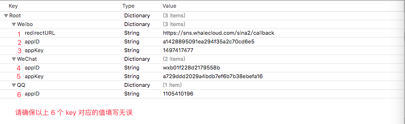
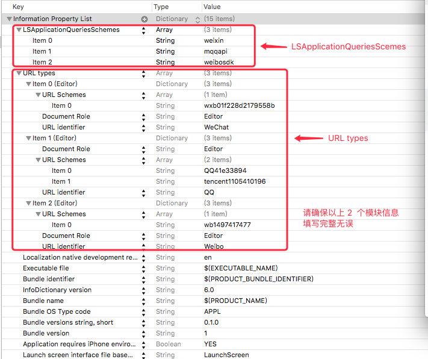

2017年3月10日17:46:10 文档校对

## 概览

Share 模块可以帮助您将分享链接（并可带有文本和图片展示）到 QQ、QQ 空间、微博、朋友圈和微信平台.

## 定义
Share 是基于[MobkeyKing](https://github.com/nixzhu/MonkeyKing) 1.1.0 构建的分享模块.   
框架包含 4 个文件：  

* TSShareCenter.swift : 分享界面展示设置代码文件，包含 `ShareView` 的显示逻辑和分享的交互设置. 

* TSShareProtocol.swift : 分享内部实现代码文件，包含 MonkeyKing 的分享实现逻辑和对 `ShareConfig.plist` 文件的数据解析.
  
* ShareConfig.plist : 分享账号配置  
  
* ShareView.xib : 分享视图


## 使用说明

### 1.三方账号信息配置
#### 1.1 ShareConfig.plist
在 ShareConfig.plist 中填写微信、腾讯、新浪三方 appKey、appID 等信息，这些信息可通过向对应的平台网站上根据其教程申请获取。

**请确保要每条信息都不为空**.  

#### 1.2 info.plist
在 info.plist 文件中配置 LSApplicationQueriesSchemes 和 CFBundleURLTypes。



#### 1.3 账号注册
在使用三方分享前，需要发送注册三方账号信息的请求，为了方便，这里将其写在 AppDelegate.swift 中.
**请确保这一步执行前，以上 2 个 plist 内账号信息已经填写完全且无误**

```swift

     func application(_ application: UIApplication, didFinishLaunchingWithOptions launchOptions: [UIApplicationLaunchOptionsKey: Any]?) -> Bool {
        // 注册账号
        // 注册腾讯账号  
        MonkeyKing.registerAccount(ShareManager.thirdAccout(type: .qq))
        // 注册新浪账号
        MonkeyKing.registerAccount(ShareManager.thirdAccout(type: .weibo))
        // 注册微信账号
        MonkeyKing.registerAccount(ShareManager.thirdAccout(type: .wechat))
        
        return true
    }
    
    func application(_ application: UIApplication, open url: URL, sourceApplication: String?, annotation: Any) -> Bool {
        // 需要获取回调信息可添加一下代码
        if MonkeyKing.handleOpenURL(url) {
            return true
        }
        return false
    }

```  
#### 1.4 分享界面设置
分享界面设置在 ShareConfig.swift 中，可根据需求进行修改。


### 2.方法调用

#### 2.1  让分享分享视图遵守 Sharable 协议

```swift

class ShareView: UIView, Sharable {

}
        
```

#### 2.2 调用分享方法
遵守了 Sharable 的类，就可以调用 `shareURLTo......` 的方法,如下图所示
        
```

class ShareView: UIView, Sharable {

	
    @IBAction func weChatBtuttonTaped(_ sender: UIButton) {
        shareURLToWeChatWith(URLString: shareUrlString, image: shareImage, description: shareDescription, title: shareTitle) { (result) in
            // 微信分享结果处理
        }
    }

    @IBAction func qqButtonTaped(_ sender: UIButton) {
        shareURLToQQ(URLString: shareUrlString, image: shareImage, description: shareDescription, title: shareTitle) { (result) in
            // QQ 分享结果处理
        }
    }

    @IBAction func zoneButtonTaped(_ sender: UIButton) {
        shareURLToQQZone(URLString: shareUrlString, image: shareImage, description: shareDescription, title: shareTitle) { (result) in
            // QQ 空间分享结果处理
        }
    }

    @IBAction func momentsButtonTaped(_ sender: UIButton) {
        shareURLToWeChatMomentsWith(URLString: shareUrlString, image: shareImage, description: shareDescription, title: shareTitle) { (result) in
            // 朋友圈分享结果处理
        }
    }

    @IBAction func weiboButtonTaped(_ sender: UIButton) {
        shareURLToWeiboWith(URLString: shareUrlString, image: shareImage, description: shareDescription, title: shareTitle) { (result) in
            // 微博分享结果处理
        }
    }
}
        
```

## 注意事项
* 1.在代码执行前，请务必确保 plist 文件内账号信息填写完全无误。


## 逻辑
分享模块分为了 2 个文件. TSShareCenter 负责视图，TSShareProtocol 负责逻辑. 这里介绍一下 TSShareProtol.  


TSShareProtol 中的 Sharable 协议运用了协议加延展的方法。

之所以采用这种两种方法，是为了方便在视图层多变的情况下，使用方法如下：

```swift

class ShareView: UIView, SharableProtocol {

}

```
这样即使以后有其他的 View 需要具有分享功能，我只需让其遵守协议即可。
