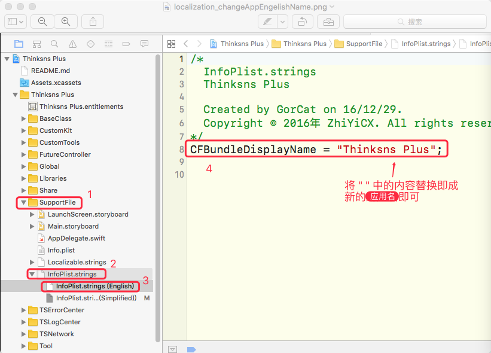
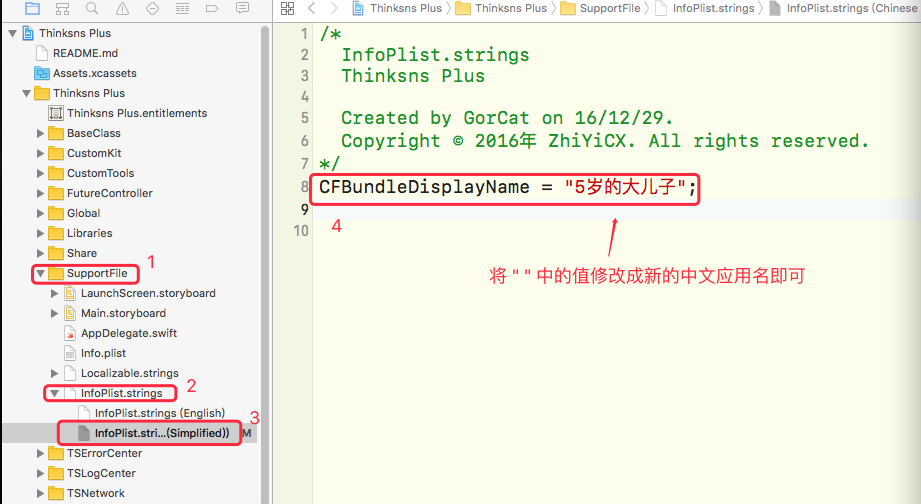
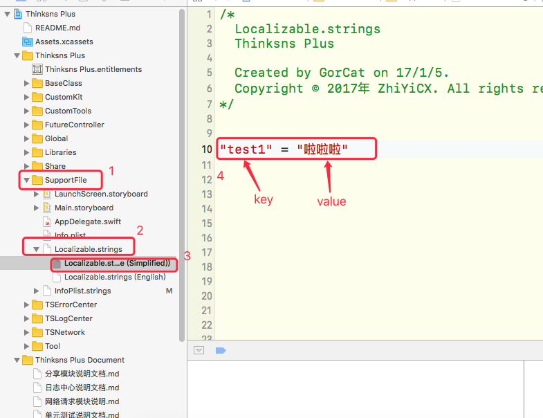
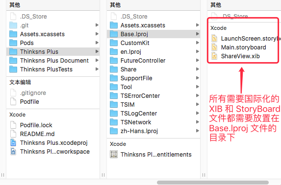
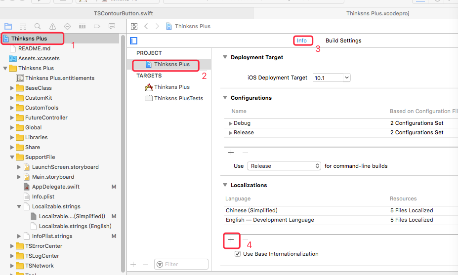
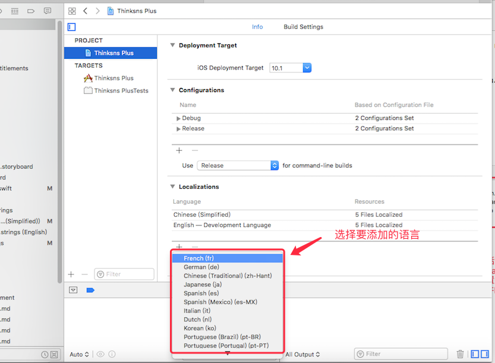
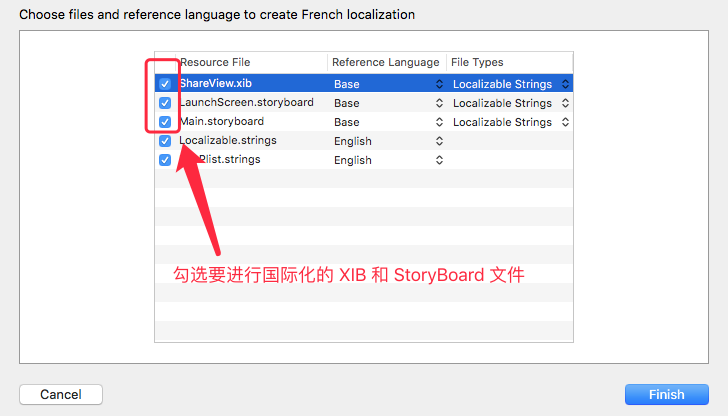
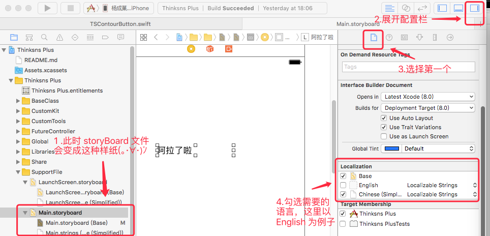
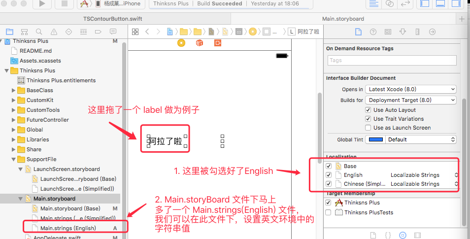
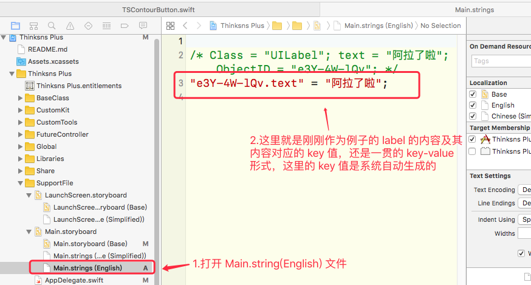

2017年3月10日17:47:40 文档校对
## 应用国际化说明文档

### 概述

此项目采用 Xcode 自带的国际化功能，具体创建过程参见[苹果官方文档](https://developer.apple.com/library/content/documentation/MacOSX/Conceptual/BPInternational/Introduction/Introduction.html#//apple_ref/doc/uid/10000171i-CH1-SW1)

当前项目包含 2 中语言：

* English 默认英文
* Simplified 简体中文

### 1. 更改 app 国际化应用名

在 Xcode 中展开 InfoPlist.strings，在其目录下对应的 InfoPlist.strings(English)、InfoPlist.strings(Simplified) 等语言文件中，更改 CFBundleDisplayName 对应的值即可。

#### 修改英文环境下的应用名称

第一步：打开 SupportFile 目录

第二步：打开 InfoPlist.strings 目录

第三步：选择 InfoPlist.string(English) 文件

第四步：更改 CFBundleDisplayName 对应的值




#### 修改中文简体环境下的应用名称

第一步：打开 SupportFile 目录

第二步：打开 InfoPlist.strings 目录

第三步：选择 InfoPlist.string(Simplified) 文件

第四步：更改 CFBundleDisplayName 对应的值



### 2. 代码中的字符串国际化使用

代码中的字符串国际化分为两个步骤

第一步：添加字符串到语言管理文件中
打开 Localizable.strings 文件，在目录下的语言管理文件中以 key-value 的形式添加国际化字符串



第二步：调用国际化字符串

当语言环境为中文时，系统会根据 key 到 Localizable.strings(Simplified) 中寻找对应的 value 值显示。

当语言环境为英文时，系统会根据 key 到 Localizable.strings(English) 中寻找对应的 value 值显示。

调用时，使用 key 字符串的 localized 属性，

``` 
        print("test1".localized)
        // 打印结果：啦啦啦

``` 

### 3. XIB 以及 StoryBoard 的国际化使用

#### 3.1 移动 XIB 和 StoryBoard 文件的位置
 

#### 3.2 添加 XIB 和 StoryBoard 文件到语言管理中

第一步

 

第二步

 

第三步

 

第四步

 

第五步

 

第六步

 

