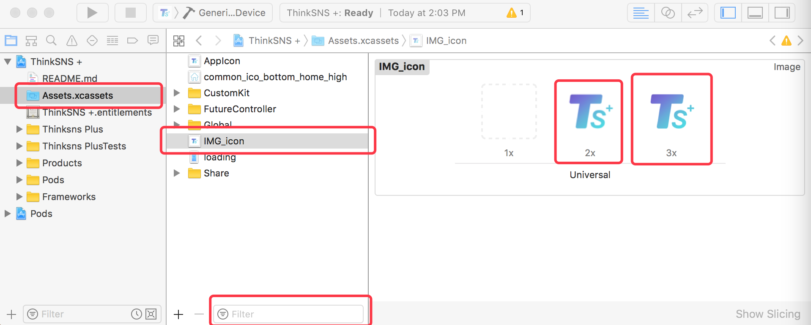
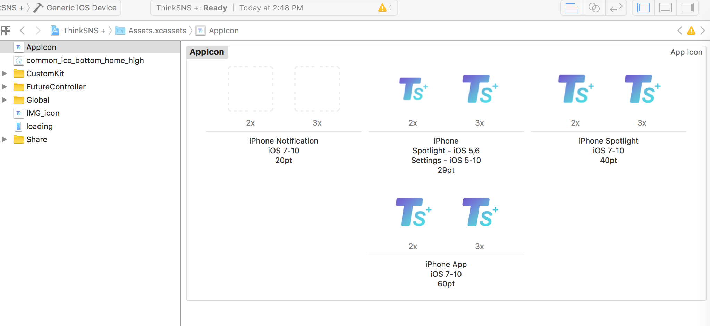
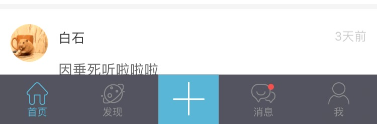
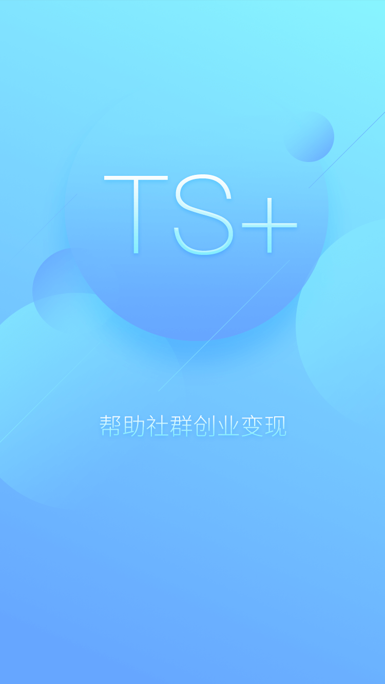
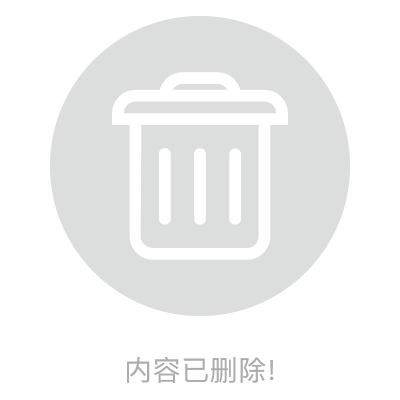
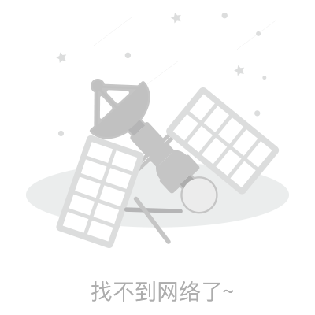

## 一、概述

#### 1. 基本概述
* 本指南只涉及一些基本的图标和图片替换，不涉及更深层次的替换。如果需要更深层次的替换，请参考具体源码。
* 基本替换图标
 * AppIcon(应用图标)
 * Tabbar(标签栏图标)
 * Share Logo(分享Logo)
* 基本图片替换
 * 启动页
 * 缺省图

#### 2. 本地图片相关
* 2.1：iOS本地图标和图片都使用png格式的
* 2.2：iOS本地图标和图片都需要2倍图和3倍图。
* 2.3：命名问题，以命名为AppIcon_20pt的正方形图标为例
 * AppIcon_20pt@2x.png (2倍图尺寸：40x40)
 * AppIcon_20pt@3x.png (3倍图尺寸：60x60)

#### 3. 约定规范
* 下面所指定的图标或图片名都是指Assets.xcassets中左侧列表栏中对应的名字，图标或图片的实际名字不是必须和指定的名字统一，但建议使用指定的名字。

#### 4. 替换示例



* 将上图中的2x和3x图片使用delete键删除掉，然后往2x和3x位置放上对应倍数的替换图片即可。如果1x位置原来有图片，必须删除，即使没有准备对应的1x图片。
* 替换时，注替换图片命名规范。前面部分参考指定命名，后面的@2x.png 和 @3x.png 一定要加上。

## 二、基本图标替换

### 1. AppIcon(应用图标)
* Assets中命名：```AppIcon```
* 尺寸：
 * 20pt的2倍图和3倍图(40x40, 60x60)、
 * 29pt的(58x58, 87×87)、
 * 40pt的(80x80, 120x120)、
 * 60pt的(120x120, 180x180)
* 图标名：名称随便，(但保证2倍图和3倍图的后缀)
* TS+图标命名：

```
icon_1024iPhoneApp_60pt@2x.png
icon_1024iPhoneApp_60pt@3x.png
icon_1024iPhoneSpootlight5_29pt@2x.png
icon_1024iPhoneSpootlight5_29pt@3x.png
icon_1024iPhoneSpootlight7_40pt@2x.png
icon_1024iPhoneSpootlight7_40pt@3x.png
```

* 参考图(没有提供20pt的，非必须)

	

### 2. Tabbar(标签栏图标)
* 参考图

	

#### 中间的 + 号
* 命名：```IMG_common_ico_bottom_add```
* 尺寸：120x98、180x147

#### 其他图标
* 统一尺寸：48×48、72x72

* 首页图标
 * 正常状态命名：```IMG_common_ico_bottom_home_normal```
 * 选中状态命名：```IMG_common_ico_bottom_home_high```

* 发现图标
 * 正常状态命名：```IMG_common_ico_bottom_discover_normal```
 * 选中状态命名：```IMG_common_ico_bottom_discover_high```

* 消息图标
 * 正常状态命名：```IMG_common_ico_bottom_message_normal```
 * 选中状态命名：```IMG_common_ico_bottom_message_high```
 * 有消息状态(小红点)命名：```IMG_common_ico_bottom_message_remind```

* 我的图标
 * 正常状态命名：```IMG_common_ico_bottom_me_normal```
 * 选中状态命名：```IMG_common_ico_bottom_me_high```
 * 有消息状态(小红点)命名：```IMG_common_ico_bottom_me_remind```


### 3. Share Logo(分享Logo)
* Assets中命名：```IMG_icon```
* 尺寸：80 × 80、120 × 120
* 使用位置：分享时的图标
* 备注：参看示例图片

## 三、基本图片替换

### 1. 启动页
* 命名：```loading```
* 尺寸：750 × 1334、1242 × 2208
* 参考图

	

### 2. 引导页
* 暂无该功能

### 3. 占位图
* 目前TS+的占位图统一为灰色，暂不可更换。

### 4. 缺省图
* 备注：下面所有的缩略图命名都为使用命名，实际命名中没有 "IMG_" 前缀，请不要问我为什么。

* 内容已删除
 * 命名：```IMG_img_default_delete```
 * 尺寸：400 × 400、600 × 600
 * 使用位置：内容被删除时的占位展示，目前主要是动态和圈子中有可能使用。
 * 参考图

	

* 无网络
 * 命名：```IMG_img_default_internet```
 * 尺寸：400 × 400、600 × 600
 * 使用位置：页面加载数据网络请求异常时展示
 * 参考图

	

* 空无一人
 * 命名：```IMG_img_default_nobody```
 * 尺寸：400 × 400、600 × 600
 * 使用位置：关注列表、粉丝列表
 * 参考图

	

* 什么都没有
 * 命名：```IMG_img_default_nothing```
 * 尺寸：400 × 400、600 × 600
 * 使用位置：列表内容为空时的占位图
 * 参考图

	
 
* 什么都没找到
 * 命名：```IMG_img_default_search```
 * 尺寸：400 × 400、600 × 600
 * 使用位置：找人
 * 参考图

	


## 四、关于广告
* 广告使用网络图片，有3种不同的地方使用。其尺寸要求也不一样

* 使用位置

| 位置 | 大小 | 建议尺寸|
|:-----:|:-----:|:-----:|
| 启动页广告 | 全屏  | 1242 × 2208 |
| 详情页广告 | 屏幕宽度，高度80pt  | 1242 × 240 |
| Banner广告 | 高度是屏幕宽度的一半，即2：1 | 1242 × 620 |


