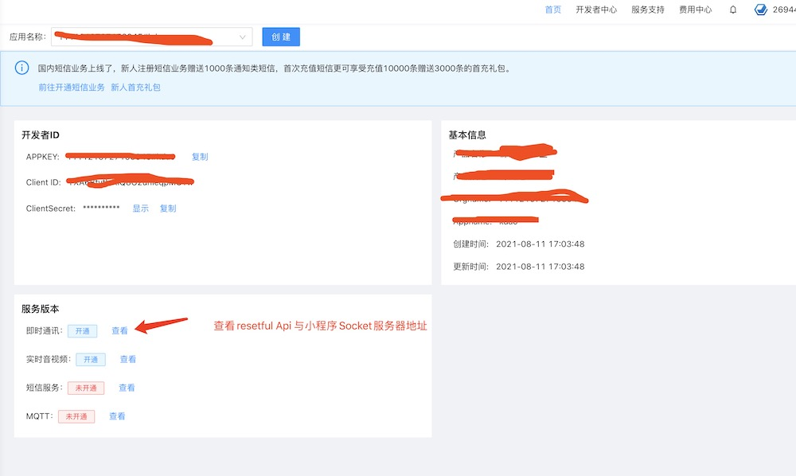

# TS 小程序打包说明

## 目录
	
- [代码配置替换](#一、代码配置替换)
- [图标资源替换](#二、图标资源替换)
- [打包上传](#三、打包上传)
- [上架注意事项](#四、上架注意事项)

-----

##### 一、代码配置替换

1. 替换小程序 `appid`

	位于 `package.json` 中的 `appid` 字段
	
	
2. 替换小程序中现在的本地小程序标题和名字

	位于 `package.json` 中的 `title`和`name` 字段，注意`name`不能使用中文

3. 替换服务器地址 

	位于 `package.json` 中的 `serverProdAPI` 字段
	
	
4. 替换聊天环信配置，位于 `package.json` 中

	- `chatkey` 字段，环信聊天`key`
	- `chatSocketServery` 字段，环信聊天中的小程序域名
	- `chatApiURL` 字段，环信聊天`REST API`

 
 
	
	
5. 替换订阅消息`key`

	
	地址：<https://mp.weixin.qq.com/>登录小程序， （功能>订阅消息>我的模板>对应的模板名称选用），项目中模板编号调整为自己的

	模板 1:名称（新订单通知），模板选用内容（下单用户、下单时间、订单编号、备注、收货地址）

	模板 2:名称（商家发货提醒），模板选用内容（商品名称、支付金额、物流信息、备注、发货时间）

	模板 3:名称（加圈成功提醒），模板选用内容（圈子名称、加入时间）

	模板 4:名称（加圈拒绝通知），模板选用内容（申请时间、申请圈子、申请人）

	替换位于 `package.json` 中的 `subscribNewOrder`、`subscribMerchantShipping`、`subscribCircleJoined`、`subscribCircleRefused`。
	
	备注： 服务器端也需要配置对应的模板编号
		
		
		
		
		
		

##### 二、图标资源替换		

	目前小程序图片资源位于三个包中，`src/pages` 、`src/mall/1images` 、 `src/mine/1images`。

	备注： 替换时确保图片的格式、名字、大小不要和原来的图片有差异 。

##### 三、打包上传

1. 项目代码导入`Visual Studio Code`
2. Terminal 中执行 `npm install 或者 yarn install # 推荐方式 (速度快)`，进行依赖安装
3. 依赖安装完成后，Terminal 中执行 `npm start 或者 yarn start # 推荐方式 (速度快)`，进行编译
4. 编译完成后将编译好的 `dist` 目录放入微信开发者中间中打开即可， `dist` 位于代码包根目录

##### 四、上架注意事项

1.  小程序管理后台（<https://mp.weixin.qq.com/>）-设置-用户生成内容场景声明

 	- UGC场景 - 选择 - 用户资料、图片、文本、（如果有信息网络传播视听节目许可证可以选择视频）
 	- 内容安全机制 - 使用其他的内容审核产品
 	- 用户审核团队 - 有团队
 	- 审核机制说明  - 建议如下说明，可自行调整
 	
 				1. 文本内容我们有铭感词顾虑替换等测试，防止用户发布涉黄、暴力等不良信息，同事运营部门会进行内容抽查已防止遗漏的部分。
				2. 图片、视频内容使用三方云平台进行涉黄、暴力等内容检测，以及运营部分的手动审核。
 	
 	
 	
 	备注： 提交上架前，管理后台-运营-铭感词，增加一些当前的铭感热词。	

2. 上架开关说明

	提交审核的过程中，把管理后台的-配置-小程序控制 ， 关闭评论功能、视频功能、打赏功能。
	
	备注： 如果有ICP备案和公安部备案的情况下可以打开评论功能，如果有网络传播视听节目许可证可以打开视频功能

3. 小程序管理后台（<https://mp.weixin.qq.com/>）- 开发管理-服务器域名

	配置对应的服务器域名、聊天域名，如果有oss也许要配置对应的oss域名

		
		
		
		
		
		
		
		
		